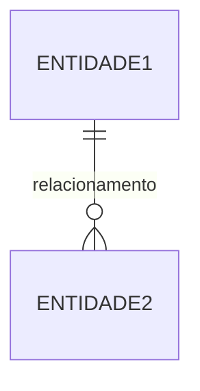

# DER — [Nome do Projeto]

## 1. Diagrama

```mermaid
erDiagram
  ENTIDADE1 ||--o{ ENTIDADE2 : relacionamento
```

## 2. Dicionário de dados

### Tabela: [nome]
| Campo | Tipo | Restrições | Descrição |
|---|---|---|---|
| id | INT | PK | |
