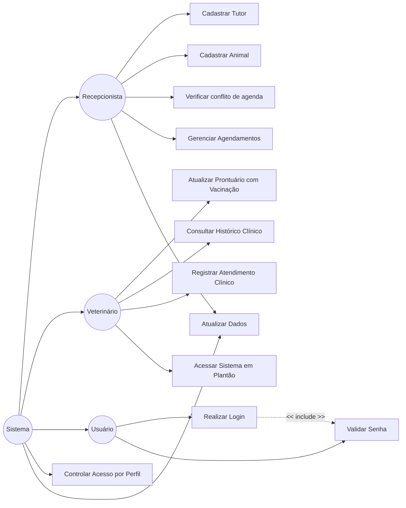
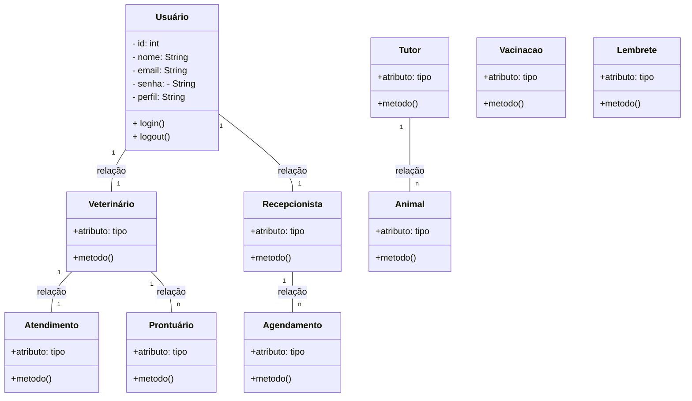

# Diagramas UML — Pet & Gatô

## 1. Diagrama de Casos de Uso

## 2. Diagrama de Classes

  
## 3. Rastreabilidade — caso de uso → história do backlog
| Caso de uso | História(s) relacionada(s) (E2) |
|---|---|
| Cadastrar Tutor | #1 |
| Cadastrar Animal | #2 |
| Verificar conflito de agenda | #5 |
| Gerenciar Agendamentos | #6 |
| Atualizar Prontuário com Vacinação | #4 |
| Consultar Histórico Clínico | #7 |
| Registrar Atendimento Clínico | #8 |
| Acessar Sistema em Plantão | #11 |
| Realizar Login | #3 |
| Validar Senha  | #3 |
| Controlar Acesso por Perfil | #9 |
| Atualizar Dados | #10 |
