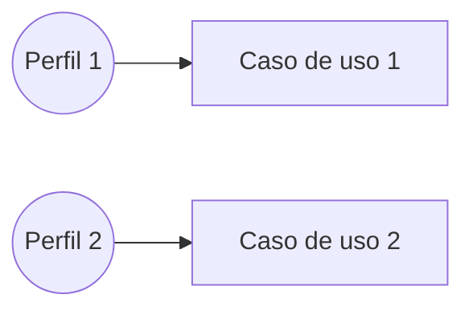
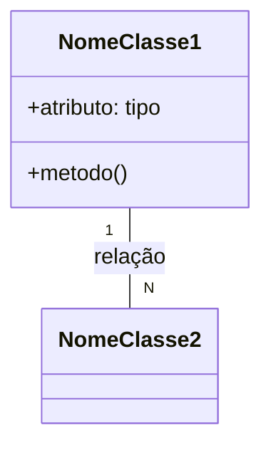

# Diagramas UML — [Nome do Projeto]

## 1. Diagrama de Casos de Uso

## 2. Diagrama de Classes

## 3. Rastreabilidade — caso de uso → história do backlog
| Caso de uso | História(s) relacionada(s) (E2) |
|---|---|
